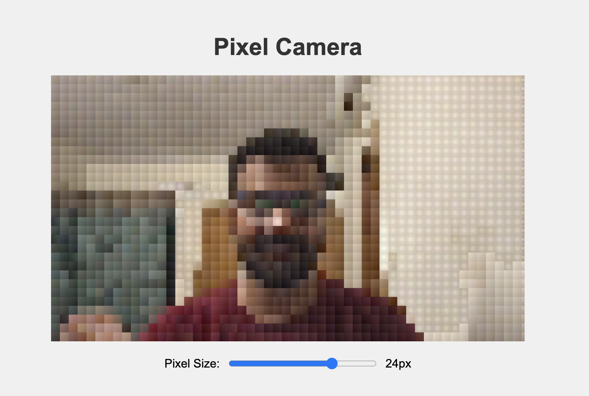

# Pixel Camera

A web-based camera application that allows you to take photos with various pixel art effects. Transform your photos into retro-style pixel art with adjustable resolution.


## ✨ Features

- Live camera feed with real-time pixel art effects
- Adjustable pixel resolution
- Screenshot capture functionality
- Mobile responsive design
- Front camera support for selfies on mobile devices
- Works in modern browsers

## 🚀 How to Use

1. Allow camera access when prompted
2. On mobile devices, use the camera switch button to toggle between front and back cameras
3. Adjust the pixel resolution slider to your preference
4. Click the capture button to take a screenshot
5. Download or share your pixelated image

## 🛠️ Technologies Used

- HTML5
- CSS3
- JavaScript
- HTML5 Canvas API
- MediaDevices API (with facingMode support for camera selection)

## 📋 Installation

1. Clone the repository:
   ```
   git clone https://github.com/yourusername/pixel-camera.git
   ```

2. Navigate to the project directory:
   ```
   cd pixel-camera
   ```

3. Open `index.html` in your browser or use a local server:
   ```
   npx serve
   ```

## 📝 License

This project is open source and available under the [MIT License](LICENSE).

## 👨‍💻 Created with ❤️ by

Connect with me on [LinkedIn](https://linkedin.com/in/yourusername)

## 🙏 Acknowledgements

- Thanks to all contributors and users of this application
- Inspired by retro pixel art and games
